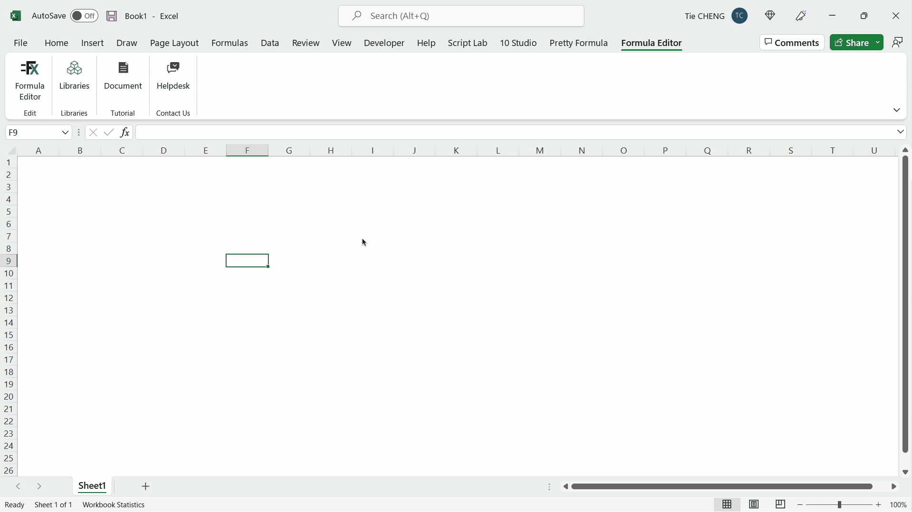

# AutoXL

**AutoXL is a fundamental and powerful library of Excel functions written in Excel formula language.** It especially enables Excel users to automate manual tasks, by extensions of lookup and references functions, and elementary functions for array and set, etc. It thus saves Excel users lots of time, and avoids tedious and error-prone manual operations.

## Function categories

At the moment, AutoXL consists of 29 functions mainly in 3 categories:
- Practical, useful, handy and powerful functions to automate manual tasks. For instance,
    - `A.LOCATE.CELLBYTEXT` to find a cell in a range that contains a given text.`A.LOCATE.RANGEBYTEXT` to find a header in a range that contains a given text and to return the data below the header
    - `A.DUPLICATES` to find duplicates in a range
- Extensions of traditional built-in "lookup and reference" functions, to make them address all real-world use cases. For instance,
    - `A.XLOOKUP.ROWS` and `A.XLOOKUP.COLS` for built-in `XLOOKUP`
    - `A.XMATCH.ROWS` and `A.XMATCH.COLS` for built-in `XMATCH`
- Elementary functions for compound data types such as array and set. For instance,
    - `A.UNION.CELLS`, `A.INTERSECT.CELLS`, `A.SETDIFF.CELLS` for set
    - `A.EQ` for array

## Users

As manual operations in Excel exist everywhere, AutoXL is **cross-sectors**. It will mainly benefit 
- Excel users who know basic functions like `VLOOKUP` and are willing to try more
- Advanced Excel users who have lots of formulas in their workbooks
- VBA developers
- Developers in other programming languages and want to realize tasks in Excel

## Demo

## Installation

**Excel version requirement:** Many functions of AutoXL are written with newly-introduced built-in functions of Excel, which require Microsoft 365 and probably don't exist in non-subscription Office 2019 or later. Therefore, AutoXL has the same requirement. You could simply type `=VSTACK` in a cell, if its intellisense shows up, that means your Excel meets the requirement.

<!-- If you don't have the good version of Excel on your machine, you could always use [Excel Online](https://www.office.com/launch/excel?ui=en-US&rs=GB&auth=1) which has new functions and is free. -->

**Get started quickly:** You could download the workbook `Demo/AutoXL-Demo.xlsx` where AutoXL has been already added. It also contains sample data and formulas which allow you to get familiar with use of functions. Formula Editor will be auto-opened.

**Installation:** Besides using Microsoft's AFE, you could use [Formula Editor](https://www.10studio.tech/docs/formulaEditor) to add the AutoXL library to your workbook, which will provide a version control. The latest stable versions of AutoXL will always be available in Formula Editor.

**Uninstallation:** To remove the library from your workbook, 
- either you could go to "Name Manager" and manually delete all the functions starting with `A.` (make sure that you don't have other user-defined functions or ranged names starting with `A.`)
- or under Formula Editor, you could go to "Libraries => AutoXL => Remove"; it will only remove AutoXL's functions.
## Documentation

The documentation on a website is coming soon. At the moment, you could refer to the comments in the file `AutoXL.txt` to see the list of the functions, their purpose, their arguments, etc.

Additionally, here are related built-in functions of Excel:
- Traditional [lookup and reference functions](https://support.microsoft.com/en-us/office/lookup-and-reference-functions-reference-8aa21a3a-b56a-4055-8257-3ec89df2b23e)
- [LAMBDA function](https://techcommunity.microsoft.com/t5/excel-blog/announcing-lambda-turn-excel-formulas-into-custom-functions/ba-p/1925546)
- [LAMBDA helper functions](https://techcommunity.microsoft.com/t5/excel-blog/announcing-lambda-helper-functions-lambdas-as-arguments-and-more/ba-p/2576648)
- [New text and array functions](https://techcommunity.microsoft.com/t5/excel-blog/announcing-new-text-and-array-functions/ba-p/3186066)

## License

AutoXL is [MIT licensed](https://github.com/MatrixFun/AutoXL/blob/main/LICENSE).
## Design principles

The design and implementation of AutoXL has the following principles:
- Make practical, useful and friendly functions for concrete common tasks driven by Excel end-users
- Make conventional and basic functions for fundamental and compound data types that Excel does not provide
- Follow existing terminology, convention and style of Excel for naming functions and arguments, and default value of parameters, etc.
- Robust, safe, easy-to-understand, and efficient implementation

<!-- rely on derived names rather than optional arguments, because we aim to benefit end-users -->

## Contributing

The AutoXL project welcomes your expertise and enthusiasm! Contributions include:

- Tell us what manual operations you undertake frequently, what you want to achieve in Excel, what functions you think good to have
- Use and test the functions of AutoXL, and report bugs
- Suggest better naming, documentation and code optimization
- Propose to write documentation
- Propose to code new functions
## Contact

You could [open an issue](https://github.com/MatrixFun/AutoXL/issues) or write to chengtie@gmail.com.

## Full list of functions
- `A.VERSION`: return the name and version of the library
- `A.EQ`: return whether two values or arrays are equal
- `A.XMATCH.ROWS` (similarly for `A.XMATCH.COLS`): search for a specified row in an array row by row, and then return the row's relative position
- `A.XLOOKUP.ROWS` (similarly for `A.XLOOKUP.COLS`): search an array row by row for a match with a given row and return the corresponding item from a second array
- `A.REDUCE.ROWS` (similarly for `A.REDUCE.COLS`): reduce an array to an accumulated value by applying a LAMBDA function to each row and returning the total value in the accumulator
- `A.SCAN.ROWS` (similarly for `A.SCAN.COLS`): scan an array row by row by applying a function to each row, and return an array that has each intermediate value
- `A.UNION.CELLS`: find the union of two arrays by cells; return an array of the unique cells that are in either of the two input arrays
- `A.UNION.ROWS` (similarly for `A.UNION.COLS`): find the union of two arrays by rows; return an array of the unique rows that are in either of the two input arrays
- `A.INTERSECT.CELLS`: find the intersection of two arrays by cells; return an array of the unique cells that are in both of the two input arrays
- `A.INTERSECT.ROWS` (similarly for `A.INTERSECT.COLS`): find the intersection of two arrays by rows; return an array of the unique rows that are in both of the two input arrays
- `A.SETDIFF.CELLS`: find the set difference of two arrays by cells; return an array of the unique cells in one array that are not in the other
- `A.SETDIFF.ROWS` (similarly for `A.SETDIFF.ROWS`): find the set difference of two arrays by rows; return an array of the unique rows in one array that are not in the other
- `A.COUNTEQ.ROWS` (similarly for `A.COUNTEQ.COLS`): count the number of rows within an array that is equal to the given row
- `A.DUPLICATED.BYTIMES`: values that occur a given number of times in an array are indicated as TRUE in the resulting array.
- `A.DUPLICATED`: values that occur a given number of times in an array are indicated as TRUE in the resulting array.
- `A.DUPLICATES.BYTIMES`: search duplicated values by occurrence times in an array and return the corresponding item from a second array
- `A.DUPLICATES`: search duplicated values in an array and return the corresponding item from a second array
- `A.LOCATE.CELLBYTEXT`: return a reference to the first cell within an array that contains a given text
- `A.JUMP`: locate a range by jumping from an origin range in a direction within a scope range to special cells, and return a reference to that range
- `A.EXTEND`: locate a range by an origin range and the direction to jump within a scope range, and return a reference to that range
- `A.LOCATE.RANGEBYTEXT`: find the first cell within an array that contains a text, extend it in a direction within a scope range to obtain a range, and return a reference to that range

## Other resources

- Video courses: [Spreadsheet Language and Programming](https://chengtie.thinkific.com/courses/excel-programming-en) and [表格语言与编程](https://study.163.com/course/courseMain.htm?courseId=1211128814&share=2&shareId=480000002246464)
- Software for spreadsheets: [www.10studio.tech](https://www.10studio.tech)
- Social media: [YouTube](https://www.youtube.com/watch?v=Jr1x1EnP1qA&list=PLOeixAylgNENCnQr9pUWjyAVFzJGbiOSX), [LinkedIn](https://www.linkedin.com/in/chengtie/)
